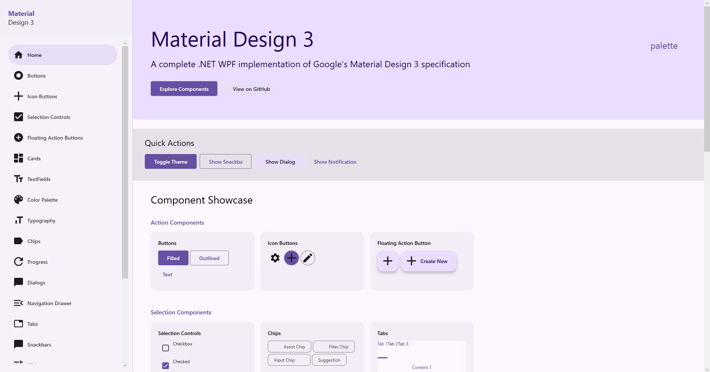

# Material Design 3 for .NET WPF

A complete implementation of Google's Material Design 3 specification for WPF applications, built from scratch in C#.



## Overview

This library provides a comprehensive set of Material Design 3 components and styles for WPF applications. Unlike other Material Design implementations, this library is built from the ground up following the official Material Design 3 guidelines.

## Features

### Complete Design System
- **Color System**: Full MD3 color palette with light theme support
- **Typography**: Complete type scale (Display, Headline, Title, Body, Label)
- **Shapes**: All corner radius tokens (ExtraSmall to ExtraLarge)
- **Elevation**: 6 elevation levels with proper shadows
- **Motion**: MD3 motion curves and durations

### Component Library (17+ Components)

#### Action Components
- **Buttons**: Filled, Elevated, Tonal, Outlined, Text buttons
- **Icon Buttons**: Standard, Filled, Filled Tonal, Outlined variants
- **Floating Action Buttons**: Standard, Small, Large, Extended FABs
- **Cards**: Elevated, Filled, Outlined cards with elevation support

#### Selection Components
- **Checkboxes**: With proper states and animations
- **Switches**: Material Design toggle switches
- **Radio Buttons**: Proper grouping and states
- **Sliders**: Continuous and discrete sliders

#### Input Components
- **Text Fields**: Filled and Outlined variants with floating labels
- **ComboBox**: Filled and Outlined with proper dropdown behavior
- **Chips**: Assist, Filter, Input, and Suggestion chips

#### Display Components
- **Progress Indicators**: Linear and Circular progress bars
- **Badges**: Small (dot) and Large (label) badges
- **Dividers**: Horizontal and vertical dividers
- **Lists**: Single-line, Two-line, Three-line list items

#### Navigation Components
- **Navigation Drawer**: Standard navigation drawer with items
- **Tabs**: Tab control with proper indicators
- **Menus**: Context menus and menu bars

#### Feedback Components
- **Dialogs**: Modal dialogs with custom content support
- **Snackbars**: Temporary messages with optional actions
- **Tooltips**: Plain and rich tooltips

### Ready-to-Use Styles

All components come with pre-defined styles following MD3 specifications:

```xaml
<!-- Filled Button -->
<Button Content="Click Me" Style="{DynamicResource MaterialDesignFilledButtonStyle}" />

<!-- Outlined Text Field -->
<TextBox Style="{DynamicResource MaterialDesignOutlinedTextBoxStyle}" 
         helpers:TextFieldAssist.Label="Label Text" />

<!-- Elevated Card -->
<Border Style="{DynamicResource MaterialDesignElevatedCardStyle}" Padding="16">
    <TextBlock Text="Card Content" />
</Border>

<!-- FAB -->
<Button Style="{DynamicResource MaterialDesignFABStyle}">
    <controls:PackIcon Kind="Add" Width="24" Height="24"/>
</Button>
```

## Installation

### Prerequisites
- .NET 8.0 SDK or later
- Windows 10/11
- Visual Studio 2022 (recommended)

### Setup

1. **Clone or download** this repository

2. **Build the library**:
   ```bash
   cd MaterialDesign.NET
   dotnet build
   ```

3. **Reference the library** in your WPF project:
   ```xml
   <ProjectReference Include="..\MaterialDesign.NET\MaterialDesign.NET.csproj" />
   ```

4. **Merge the resource dictionary** in your App.xaml:
   ```xaml
   <Application.Resources>
       <ResourceDictionary>
           <ResourceDictionary.MergedDictionaries>
               <ResourceDictionary Source="pack://application:,,,/MaterialDesign.NET;component/Themes/Generic.xaml" />
           </ResourceDictionary.MergedDictionaries>
       </ResourceDictionary>
   </Application.Resources>
   ```

## Usage

### Basic Setup

```xaml
<Window x:Class="YourApp.MainWindow"
        xmlns="http://schemas.microsoft.com/winfx/2006/xaml/presentation"
        xmlns:x="http://schemas.microsoft.com/winfx/2006/xaml"
        xmlns:controls="clr-namespace:MaterialDesign.NET.Controls;assembly=MaterialDesign.NET"
        xmlns:helpers="clr-namespace:MaterialDesign.NET.Helpers;assembly=MaterialDesign.NET"
        Title="Your App">

    <StackPanel Margin="24">
        <!-- Typography -->
        <TextBlock Text="Headline" Style="{DynamicResource MdSysTypescale.HeadlineLarge}" />
        
        <!-- Button -->
        <Button Content="Click Me" 
                Style="{DynamicResource MaterialDesignFilledButtonStyle}" 
                Margin="0,16,0,0" />
        
        <!-- Text Field -->
        <TextBox Style="{DynamicResource MaterialDesignFilledTextBoxStyle}"
                 helpers:TextFieldAssist.Label="Enter text"
                 Margin="0,16,0,0" />
        
        <!-- Icon -->
        <controls:PackIcon Kind="Home" Width="24" Height="24" Margin="0,16,0,0" />
    </StackPanel>
</Window>
```

### Available Resources

#### Typography Styles
- `MdSysTypescale.DisplayLarge/Medium/Small`
- `MdSysTypescale.HeadlineLarge/Medium/Small`
- `MdSysTypescale.TitleLarge/Medium/Small`
- `MdSysTypescale.BodyLarge/Medium/Small`
- `MdSysTypescale.LabelLarge/Medium/Small`

#### Color Resources
- `MdSysColor.Primary/OnPrimary/PrimaryContainer/OnPrimaryContainer`
- `MdSysColor.Secondary/OnSecondary/SecondaryContainer/OnSecondaryContainer`
- `MdSysColor.Tertiary/OnTertiary/TertiaryContainer/OnTertiaryContainer`
- `MdSysColor.Surface/OnSurface/SurfaceContainer`
- `MdSysColor.Error/OnError/ErrorContainer/OnErrorContainer`
- And many more...

## Project Structure

```
material-design.NET/
├── MaterialDesign.NET/          # Core library
│   ├── Controls/                # All MD3 controls
│   │   ├── Button/
│   │   ├── TextField/
│   │   ├── Card/
│   │   ├── Dialog/
│   │   └── ... (17+ components)
│   ├── Helpers/                 # Attached properties and helpers
│   │   ├── TextFieldAssist.cs
│   │   ├── ChipAssist.cs
│   │   └── ShadowAssist.cs
│   ├── Converters/              # Value converters
│   ├── Themes/                  # Design tokens
│   │   ├── Colors/
│   │   ├── Type/
│   │   ├── Shapes/
│   │   ├── Elevation/
│   │   └── Motion/
│   └── Resources/
│       └── Fonts/
├── MaterialDesign.Demo/         # Demo application
│   ├── Pages/                   # Component showcase pages
│   ├── Domain/                  # Demo view models
│   └── Styles/
└── docs/                        # Documentation
```

## Demo Application

The solution includes a comprehensive demo application showcasing all components:

```bash
cd MaterialDesign.Demo
dotnet run
```

The demo app includes:
- 17 component showcase pages
- Interactive examples
- Source code snippets
- Navigation drawer
- Dialog demonstrations

## Icon System

### PackIcon (Built-in Paths)
180+ icons with pre-defined path geometries:

```xaml
<controls:PackIcon Kind="Home" Width="24" Height="24" />
<controls:PackIcon Kind="Settings" Foreground="Red" />
```

Available icon kinds include: Add, Edit, Delete, Home, Settings, Favorite, Search, and 170+ more.

### SymbolIcon (Font-based)
Alternative icon control using Material Symbols font:

```xaml
<controls:SymbolIcon Symbol="home" Variant="Outlined" FontSize="24" />
<controls:SymbolIcon Symbol="favorite" Filled="True" />
```

### Development Guidelines
- Follow MD3 specifications
- Maintain consistency with existing components
- Include XML documentation for public APIs
- Test in the demo application

## Roadmap

- [ ] Dark theme support
- [ ] Additional components (Date Picker, Time Picker, Data Table)
- [ ] Animation improvements
- [ ] Accessibility enhancements
- [ ] More icon variants
- [ ] Documentation website

## Known Limitations

- Currently only light theme is supported
- Some advanced MD3 components not yet implemented
- Icon library limited to 180+ icons (PackIcon)

## License

This project is licensed under the Apache-2.0 License - see the [LICENSE](LICENSE) file for details.

## Acknowledgments

- [Material Design 3 Guidelines](https://m3.material.io/)
- [Material Symbols](https://fonts.google.com/icons)